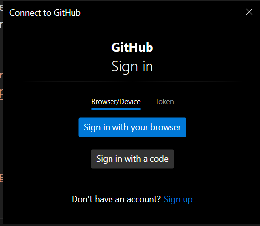

# GIT
> Sistema de control de versiones 
> Nacio juntamente con Linux

# Pasos 

- Inicializamos un repositorio
``` bash
    git init
```

### Si es la primera vez que usamos GIT en el dispositivo
- Configuramos el usuario
``` bash
    git config user.name "Jonathan"
    git config user.email "jonathan.cruz@davinci.edu.ar"
```

o configuro globalmente
``` bash
    git config --global user.name "Jonathan"
    git config --global user.email "jonathan.cruz@davinci.edu.ar"
```

# Estados


- Agrego los archivos
``` bash
 git add README.md
```

- Creamos un commit 
``` bash
git commit -m "Proyecto Base"
```

- Para saber el estado del repositorio
``` bash
git status
```

- Me creo una cuenta en Github
-  Vínulamos el repositorio con lo local
``` bash

git remote add origin https://github.com/jonathancruzdev/prueba2024.git
```

- Para subir los commits a la nube
``` bash
    git push origin master
```


# Creamos una rama
``` bash
    git branch <nombre>
```